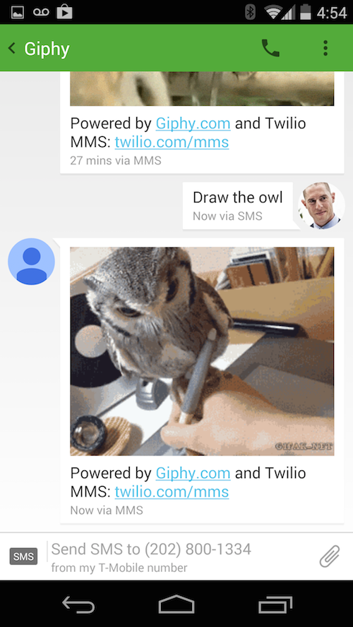

# Animated GIFS via MMS

Custom animated GIFs delivered to your phone via the [Giphy API](https://github.com/giphy/GiphyAPI) and [Twilio MMS](http://twilio.com/mms). 

### Text a search phrase to (202) 800-1334 to try it out.

This service is built in Ruby on Sinatra. To run this locally, [sign up for a Twilio account](http://www.twilio.com) and purchase an MMS enabled number for $1. On the [Giphy API]() side, you can build an app using the public beta key, but you'll want to get an individual API key from the Giphy team before scaling to production. 

Then... 

1. Clone this repo. 
2. Run ```bundle install``` to install the gems. 
3. From a terminal, set the following environment variables: 

```
export ACCOUNT_SID=yourtwilioaccountsidhere
export AUTH_TOKEN=yourtwilioauthtokenhere
export TWILIO_PHONE_NUMBER=+13128675309
export GIPHY_API_KEY=yourgiphyapikey
```

4. Start the sinatra server: 

```
ruby twilio.rb
```

5. Open a tunnel to your local machine. If you [use ngrok](https://www.twilio.com/blog/2013/10/test-your-webhooks-locally-with-ngrok.html) with custom subdomains, use: 

```
./ngrok -subdomain=example 4567
```

6. Click on your shiny new phone number in your Twilio dashboard and set the messaging webhook to ```http://example.ngrok.com/sms```

And then send a text message to your Twilio number to get your response. Ping me if you have questions at [gb@twilio.com](mailto:gb@twilio.com) or [@greggyb](http://twitter.com/greggyb). 


